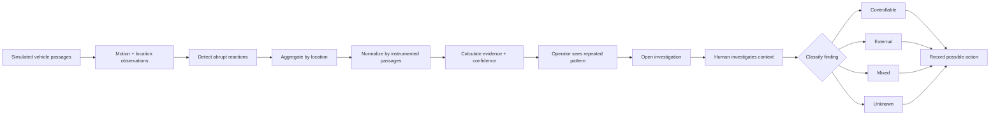
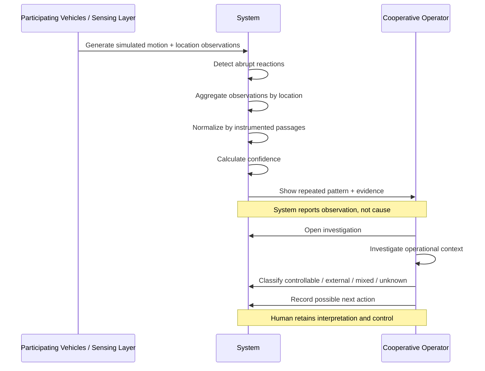

# WEEK 7 — PRODUCT PACKET

**Role:** Technologist  
**Product:** Operational Mobility Data  
**Core principle:** **Transfer memory before control.**

> **Scope lock:** ONE ROUTE · ONE AGGREGATED SIGNAL LAYER · ONE INVESTIGATION WORKFLOW

---

## 0. Why This Feature? — Brief → Team Bending → Build

My Brain Bending began with the idea that autonomy is a sequence of capability transfers and that the first useful transfer is **memory at scale**.

Team Bending kept that capability but added an important constraint: operational legibility cannot become individual surveillance or extraction.

This build therefore tests a narrower question:

> **Can aggregated smartphone-derived signals create a useful investigation queue without becoming a driver surveillance system?**

The build is not trying to prove that more mobility data is always good. It tests whether one narrow capability transfer can create operational value while keeping interpretation and control with humans.

---

## 1. Problem in My Words

Mexico does not need to jump from human driving to autonomous vehicles to benefit from machine capability.

Drivers and operators already notice where a route repeatedly produces hard braking, abrupt turns, bumps, or other unusual reactions. The problem is that this knowledge is fragmented across individual trips and individual people. When the trip ends, much of that evidence disappears with it.

The first useful capability to transfer is:

> **Memory at scale.**

A smartphone can record motion and location signals across repeated passages. Aggregated across a route, those observations can reveal where unusual reactions repeatedly occur.

The product does **not** determine why they happen.

It creates operational memory so a human operator knows **where to investigate**.

---

## 2. Exact User

The primary user is an **operations coordinator at a small colectivo cooperative or operator in Mexico City**.

They:

- understand the route operationally but are not a data scientist;
- have limited time to inspect evidence;
- can investigate recurring route problems;
- can influence controllable practices such as stop behavior, schedules, operating rules, or vehicle conditions;
- need a small decision tool, not another complicated fleet-management platform.

Their core question is:

> **Where on my route is something repeatedly happening that deserves investigation?**

---

## 3. Success Definition

**Before the module closes:**

> **An operator can open one simulated route, identify a location with an unusually high normalized rate of abrupt reactions, understand the evidence and uncertainty behind that signal, open an investigation, classify what they found, and record a possible operational response — without seeing or generating an individual driver score.**

Success is **not**:

- detecting a “dangerous road”;
- predicting a crash;
- identifying a bad driver;
- assigning blame;
- automatically choosing an operational response.

Success is moving from:

> **DETECT → INVESTIGATE → CLASSIFY**

while keeping interpretation with the human.

---

## 4. Product Claim + Claim Boundaries

The product may say:

> **“Abrupt vehicle reactions repeatedly occur here across observed passages.”**

It may show:

- abrupt events;
- instrumented passages;
- events per 100 passages;
- number of distinct participating vehicles;
- confidence level;
- aggregate event mix.

It may **not** say:

- this driver is unsafe;
- this road is objectively dangerous;
- this event almost caused a crash;
- this driver caused the pattern;
- this location caused the reaction;
- this operational change will prevent an accident.

> **The system observes. The human investigates.**

---

## 5. Main Product Mockup

The main screen should feel like a **small operational tool**, not a futuristic autonomous-vehicle control center.

It should contain:

- one simulated colectivo route;
- normal route locations;
- 2–3 detected repeated-reaction locations;
- a selected hotspot;
- events per 100 passages;
- passage count;
- participating vehicle count;
- confidence;
- **What we know**;
- **What we don't know**;
- an **Investigate** action;
- an **Export Operational Data** action;
- a visible **SIMULATED PILOT DATA** label.


### Selected-location example

**Location 04**

**8.2 abrupt events / 100 passages**

- 46 instrumented passages
- 11 participating vehicles
- Confidence: **MEDIUM**

**What we know**

Abrupt reactions occur here more frequently than at most observed locations on this route.

**What we don't know**

Why the reactions occurred, whether the location is dangerous, or who is responsible.

**Action:** `Investigate →`

---

## 6. Product Flow — Mermaid

This diagram is the product logic and should remain in `PACKET.md` as Mermaid code.



### Visual rendering


**Boundary:** the system detects and summarizes evidence. The operator investigates, classifies, and chooses the next action.

---

## 7. Actor Flow / Swimlane — Mermaid

More than one actor touches the process, so the packet includes an explicit actor flow.



### Visual rendering


---

## 8. Core Metric

The primary metric is:

> **Abrupt events per 100 instrumented passages**

Formula:

```text
eventRate = (abruptEvents / instrumentedPassages) × 100
```

Example:

| Metric | Value |
|---|---:|
| Abrupt events / 100 passages | 8.2 |
| Instrumented passages | 46 |
| Distinct participating vehicles | 11 |
| Confidence | Medium |

Raw event counts are insufficient because locations with more vehicle exposure will naturally produce more observations.

The denominator makes the signal comparable across locations.

---

## 9. Confidence Logic

Every detected location displays:

- **Low**
- **Medium**
- **High**

Confidence represents **strength of evidence coverage**, not severity or danger.

For the prototype:

| Confidence | Prototype rule | Meaning |
|---|---|---|
| Low | `<30 passages OR <5 vehicles` | Too little coverage for a strong pattern |
| Medium | `30–100 passages AND 5–10 vehicles` | Enough repeated observation to justify investigation |
| High | `>100 passages AND >10 vehicles` | Pattern supported by broader repeated observation |

These are **prototype rules**, not scientific safety thresholds.

> **Low coverage must remain visible. Never hide weak evidence.**

---

## 10. Investigation Workflow

The dashboard is only the first half of the product. The critical handoff is from **machine observation** to **human interpretation**.


The operator:

1. selects a detected location;
2. reviews evidence and uncertainty;
3. opens an investigation;
4. investigates operational context;
5. classifies the finding;
6. records an optional note;
7. records a possible next action;
8. saves the investigation to operational memory.

### Classification options

#### Controllable

Possible examples:

- vehicle condition;
- stop practice;
- schedule;
- operating rule.

#### External

Possible examples:

- road condition;
- traffic;
- construction;
- geometry;
- signal timing.

#### Mixed

Both operational and external factors appear relevant.

#### Unknown

There is not enough information to explain the pattern.

**Unknown must be a valid final outcome.**

---

## 11. Decision Rules

| Rule | Product behavior |
|---|---|
| **Hotspot ≠ danger** | A hotspot is an elevated observed reaction rate relative to exposure. It triggers investigation; it is not a safety verdict. |
| **Low confidence → collect more evidence** | Low-confidence locations remain visible, but the interface should discourage strong conclusions. |
| **Medium / High confidence → investigation permitted** | Stronger coverage makes a location more useful to investigate, not automatically more dangerous. |
| **Classification is always human** | The system detects motion patterns. The operator classifies operational context. |
| **No automatic action** | The system does not discipline, reroute, change schedules, blame, or automatically select corrective action. |
| **Unknown is valid** | The product never forces the operator to invent causality. |

---

## 12. Dragon Stack

This week's technical floor is:

> **Geodata / maps + ML + one more**

This prototype satisfies it with:

### 1. Geodata / Maps

One simulated Mexico City colectivo route displayed geographically or through a lightweight map implementation.

The map shows:

- route geometry;
- observed locations;
- detected hotspots;
- click-to-select behavior.

The unit of analysis is the **route location**, not an individual vehicle.

### 2. ML

A small, interpretable classifier converts simulated sensor windows into motion-event categories:

- Normal
- Hard braking
- Abrupt turn
- Bump / vibration

Possible input features:

- longitudinal acceleration;
- lateral acceleration;
- acceleration magnitude;
- gyroscope rotation;
- speed change;
- approximate GPS location;
- route-location ID.

The goal is **not production-grade model accuracy**.

The goal is to demonstrate:

> simulated phone telemetry → feature extraction → event classification → geographic aggregation

All ML-derived output must be labeled:

> **SIMULATED ML OUTPUT**

### 3. Phone Telemetry / Sensors

Synthetic smartphone data represents:

- GPS;
- accelerometer;
- gyroscope;

across repeated vehicle passages.

No real phone telemetry is collected.

---

## 13. Benchmark Line

**Best existing solution on Earth:**  
Cambridge Mobile Telematics StreetVision demonstrates that behavioral telematics, including harsh braking, can be spatially aggregated for proactive road-safety analysis.

**Mine differs or localizes by:**  
Testing a lightweight cooperative-level version for Mexico City's colectivo environment using smartphone-derived signals, explicit exposure normalization, visible confidence, human investigation, no individual driver scoring, and exportable operational memory.

**Secondary benchmark:**  
Boston Street Bump demonstrated that passive smartphone accelerometers and GPS can reveal recurring roadway conditions.

The novelty is **not the sensor**. The build tests the local operating model, normalization, investigation workflow, and governance boundary.

---

## 14. Three-Year Light Charter

If this slice works, the product becomes a **cooperative-owned operational memory layer for human-driven mobility**.

Over three years, repeated observations could help operators understand recurring route conditions, test operational changes, and preserve local mobility knowledge across drivers and vehicles.

These capabilities may eventually support more automated mobility systems, but autonomy remains **option value rather than the present business case**.

---

## 15. Scope Cut — What We Are NOT Building

We are **not** building:

- autonomous driving;
- vehicle control;
- a ride-hailing app;
- navigation;
- Waze;
- crash prediction;
- causal safety claims;
- real phone sensor ingestion;
- background mobile tracking;
- a driver-facing app;
- driver profiles;
- driver scores;
- driver rankings;
- driver discipline;
- real-time fleet management;
- neural networks;
- LLM classification;
- external AI APIs;
- payments;
- a production database;
- a full GIS platform;
- multiple routes;
- anything using real personal data.

> **Scope discipline: ONE ROUTE · ONE AGGREGATED SIGNAL LAYER · ONE INVESTIGATION WORKFLOW.**

---

## 16. Architecture + Stack

| Layer | Choice | Purpose | Why this week |
|---|---|---|---|
| Frontend | Next.js + TypeScript | Dashboard + investigation workflow | Fast, familiar, Vercel-ready |
| Styling | Existing CSS / Tailwind if already installed | Clear operational UI | Avoid design-system overhead |
| Geodata | MapLibre or simplest free compliant map | One route + hotspots | Satisfies geodata requirement without paid APIs |
| Data | Local synthetic JSON / TS objects | Passages, sensor windows, locations | No DB or personal data needed |
| ML | Small interpretable classifier | Motion-event classification | Satisfies Dragon Stack without unnecessary infrastructure |
| Normalization | TypeScript utility | Events / 100 passages | Makes exposure explicit |
| Confidence | Deterministic prototype rules | Low / Medium / High | Transparent and testable |
| Investigation | Local application state | Human classification + action | No production backend required |
| Export | CSV or JSON | Capability portability | Makes governance visible |
| Hosting | Vercel | Live prototype | Free and fast |

### Architecture principle

Prefer a **frontend-only architecture** unless a technical requirement makes that impossible.

Do not add:

- Python backend;
- ML server;
- Supabase;
- auth;
- external AI APIs;

unless the implementation genuinely requires them.

---

## 17. Minimal Data Model

```ts
type EventClass =
  | "normal"
  | "hard_braking"
  | "abrupt_turn"
  | "bump";

type Confidence = "low" | "medium" | "high";

type InvestigationClassification =
  | "controllable"
  | "external"
  | "mixed"
  | "unknown";

interface SensorObservation {
  id: string;
  routeLocationId: string;

  // Synthetic telemetry only
  latitude: number;
  longitude: number;
  longitudinalAcceleration: number;
  lateralAcceleration: number;
  accelerationMagnitude: number;
  gyroscopeRotation: number;
  speedChange: number;

  simulatedLabel?: EventClass;
}

interface RouteLocation {
  id: string;
  label: string;
  latitude: number;
  longitude: number;

  passageCount: number;
  distinctVehicleCount: number;
  abruptEventCount: number;
  eventsPer100Passages: number;

  confidence: Confidence;
  eventMix: Record<EventClass, number>;
}

interface Investigation {
  id: string;
  locationId: string;
  classification: InvestigationClassification;
  note?: string;
  possibleAction?: string;
  createdAt: string;
}
```

The application stores **no**:

- driver name;
- driver ID;
- driver score;
- personal profile;
- individual performance history.

---

## 18. Team-Bending Conditions

The build must honor these conditions.

### 1. Narrow claims

Report observed patterns and confidence.

Do not infer blame or causality that the evidence cannot support.

### 2. Action before collection

Every signal must connect to a defined human decision.

Data collection alone is not success.

### 3. Uncertainty stays visible

Coverage, sample size, confidence, and simulated status cannot be hidden.

### 4. No individual punishment layer

No:

- driver leaderboard;
- driver score;
- driver profile;
- worker rating;
- automatic disciplinary recommendation.

### 5. Capability remains portable

The cooperative must be able to export the operational memory it helped create.

### 6. Shadow Clause

> **Legibility cannot become extraction.**

Operational knowledge cannot quietly become surveillance, displacement, training data, or economic value for another actor without governance and retained agency.

---

## 19. Export / Capability Portability

The interface includes:

> **Export Operational Data**

Export as CSV or JSON.

The export may include:

- location;
- normalized event rate;
- passage count;
- distinct participating vehicle count;
- confidence;
- aggregate event mix;
- investigation classification;
- note;
- possible action.

The export must **not** include:

- driver names;
- driver IDs;
- individual trip histories;
- individual performance records;
- driver scores.

---

## 20. Security Floor

### No secrets

The MVP should not require external API keys.

If a key becomes necessary, it must live in Vercel environment variables and never in code or Git.

### No real personal data

Use synthetic data only.

No real:

- driver names;
- phone numbers;
- license plates;
- GPS traces;
- employee records.

### Auth / database

The MVP should avoid storing personal data and should not need a production database.

Therefore auth and RLS are intentionally avoided **by architecture**, not forgotten.

If personal data becomes necessary, stop and reconsider the architecture before implementing it.

### Input validation

Validate:

- investigation classification;
- note length;
- possible-action length.

Nothing should be accepted without basic type and length validation.

### Demo labels

Display:

> **SIMULATED PILOT DATA**

and, where applicable:

> **SIMULATED ML OUTPUT**

---

## 21. Test Plan

### 21.1 Mechanical Pass

Run all of the following:

1. **Normalization test**  
   Verify `events / 100 passages` is calculated correctly.

2. **Exposure test**  
   Create two locations where one has more raw events but a lower normalized rate. Confirm raw event count does not automatically determine priority.

3. **ML classification test**  
   Verify synthetic sensor windows produce the expected event categories for known test cases.

4. **Confidence test**  
   Verify Low / Medium / High labels follow the prototype rules.

5. **Hotspot-selection test**  
   Selecting a location must open the correct evidence.

6. **Claim-boundary test**  
   No screen may label a road dangerous or a driver unsafe.

7. **Investigation test**  
   Open an investigation and classify it as Controllable, External, Mixed, or Unknown.

8. **Unknown test**  
   Confirm the workflow can finish successfully with `Unknown`.

9. **Input-validation test**  
   Invalid classification values and excessive note/action lengths must be rejected.

10. **Export test**  
    Export Operational Data must produce a readable CSV or JSON file.

11. **Privacy test**  
    Search the interface and export for driver identity, score, leaderboard, or individual performance history. None should exist.

12. **Simulation-label test**  
    `SIMULATED PILOT DATA` and `SIMULATED ML OUTPUT` must be visible wherever appropriate.

13. **Basic usability test**  
    The primary task must remain usable on a standard laptop viewport.

### Mechanical-pass requirement

> **Find at least one real bug, document it, fix it, and redeploy.**

Do not invent a fake bug.

---

## 22. Persona Test

### Synthetic persona

**Laura, 41**, is an operations coordinator for a small colectivo cooperative in Mexico City.

She:

- understands route operations;
- is not a data scientist;
- has about ten minutes to inspect the dashboard;
- wants to know where to investigate first;
- does not want another complicated fleet-management system;
- does not want a tool that creates problems with drivers.

In a **fresh chat**, walk Laura through screenshots in order.

Ask:

1. What do you think this screen is telling you?
2. What would you investigate first, and why?
3. What does “8 events / 100 passages” mean to you?
4. Do you think the system is accusing a driver of something?
5. What does the confidence label mean to you?
6. What would you do next?
7. What feels confusing, too technical, or untrustworthy?
8. Would this evidence make you investigate or change an operational practice?

Log every hesitation or misunderstanding.

Fix the **single most consequential confusion** before the final deployment and document the before/after change.

---

## 23. What Would Falsify the Idea?

The prototype should be allowed to fail.

The idea is weakened or falsified if:

- normalized patterns cannot be distinguished consistently from simulated noise or exposure effects;
- the operator cannot understand `events per 100 passages` without substantial explanation;
- the operator interprets a hotspot as a driver accusation or definitive safety judgment despite the claim boundaries;
- confidence labels do not affect how cautiously the operator interprets evidence;
- the investigation workflow is not usable within roughly ten minutes;
- the evidence does not change what the operator chooses to investigate or what information they seek next;
- removing driver-level identity makes the evidence operationally useless, revealing a genuine tension between the governance constraint and the value proposition;
- the product creates a record but no plausible operational action or learning loop follows from it.

### Pass condition

> The prototype does not need to prove causality. It needs to show that aggregated evidence is understandable enough to change what the operator investigates next while preserving the no-driver-score boundary.

---

## 24. Definition of Done

The build is done when:

- [ ] one simulated colectivo route loads;
- [ ] geodata / map layer works;
- [ ] synthetic phone telemetry exists;
- [ ] lightweight ML classifies simulated motion events;
- [ ] ML outputs are labeled as simulated;
- [ ] at least 2–3 locations show different normalized reaction rates;
- [ ] hotspots show different confidence levels;
- [ ] selected hotspot shows event rate, passages, vehicles, confidence, event mix, **What we know**, and **What we don't know**;
- [ ] operator can open an investigation;
- [ ] operator can classify it as Controllable / External / Mixed / Unknown;
- [ ] operator can record an optional note and possible action;
- [ ] no individual driver identity or score appears anywhere;
- [ ] operational data exports successfully;
- [ ] simulated-data labels are visible;
- [ ] mechanical tests are documented;
- [ ] at least one real bug is found and fixed;
- [ ] persona test is documented;
- [ ] the worst persona confusion is fixed;
- [ ] at least five meaningful commits exist;
- [ ] at least two deployments exist;
- [ ] `docs/DECISIONS.md` is updated at every Session Close.

---

## 25. Build Principle

> **Transfer memory before control.**

Detect a pattern.  
Expose the evidence.  
Preserve uncertainty.  
Hand interpretation back to the human.

This prototype is successful if it demonstrates that technology can remember repeated mobility conditions at a scale individual people cannot while refusing to turn observation into blame.

The technical stack is deliberately narrow:

> **GEODATA / MAPS + ML + PHONE TELEMETRY**

And the product remains:

> **ONE ROUTE · ONE AGGREGATED SIGNAL LAYER · ONE INVESTIGATION WORKFLOW.**
